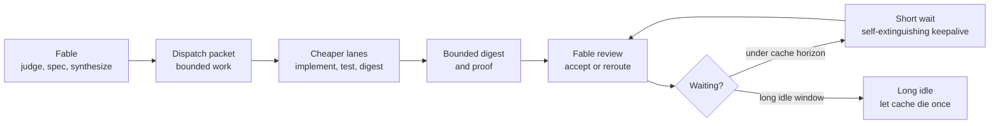

# 🧚 Fable Token-Saving Skills Orchestrator


[](https://github.com/100yenadmin/fable-token-saving-skills-orchestrator/actions/workflows/ci.yml)
[](LICENSE)


Fable is excellent at judgment: strategy, architecture, decomposition, review,
and synthesis. It is also expensive enough that letting it type every routine
line of code, reread giant logs, or wake from a cold prompt every few minutes is
usually the wrong shape.

This repo packages the practices we have found useful so far into an additive
kit for Claude Code style setups. It gives you a `CLAUDE.md` addendum, hooks,
skills, and docs you can layer onto your existing configuration without
replacing it. It is additive, not a replacement.

| What You Get | Purpose |
| --- | --- |
| Additive `CLAUDE.md` block | Fable-first orchestration, dense turns, routing, and wait discipline |
| Stop hooks | Fail-open guards for common long-running-agent stop mistakes |
| Skill templates | Reusable routing, Codex dispatch, and run-economics workflows |
| Dry-run installer | Safe setup that does nothing unless `--apply` is present |
| Public docs | Cache economics, lane routing, troubleshooting, and model-name adaptation |
| Focused tests | Installer, hooks, and docs-safety checks for public reuse |

The point is not "never use Fable." The point is to use Fable where it is
uniquely valuable, then route mechanical work, large-output digestion, parallel
verification, and long-running side lanes elsewhere.



## Quick Start

Dry-run the install first:

```bash
python3 scripts/install.py --dry-run --claude-home "$HOME/.claude"
```

Apply everything:

```bash
python3 scripts/install.py --apply --claude-home "$HOME/.claude"
```

Install only one surface:

```bash
python3 scripts/install.py --apply --install-hooks
python3 scripts/install.py --apply --install-skills
python3 scripts/install.py --apply --append-addendum
```

The installer is additive:

- it appends a marked block to `CLAUDE.md`
- it copies hooks into `~/.claude/hooks`
- it copies skills into `~/.claude/skills`
- it registers Stop hooks in `settings.json`
- it writes timestamped backups before changing existing files
- it does nothing unless `--apply` is present

## Why This Works

Anthropic prompt caching is the economic backdrop. Official docs say the
default prompt cache lifetime is 5 minutes and that cache use refreshes the
cache. Official pricing says 5-minute cache writes cost 1.25x base input and
cache reads cost 0.1x base input.

Sources:

- [Anthropic prompt caching docs](https://platform.claude.com/docs/en/build-with-claude/prompt-caching)
- [Anthropic pricing docs](https://platform.claude.com/docs/en/about-claude/pricing)

That makes long orchestration loops weirdly sensitive to idle gaps. If Fable
dispatches lanes, waits 6 to 8 minutes, processes one wake, and waits again,
you can repay cold context repeatedly. A short keepalive read is much cheaper
than a cold rewrite when a lane is expected back soon.

The practical rule:

- Do dense turns while lanes run.
- Keep Fable doing judgment and integration, not rote typing.
- Digest large outputs before Fable reads them.
- Use a self-extinguishing keepalive only for short waits.
- Let the cache die once for genuinely long idle windows.

## What To Read

- [Install guide](docs/install.md)
- [Lane routing](docs/lane-routing.md)
- [Dense turns](docs/dense-turns.md)
- [Keepalive economics](docs/keepalive-economics.md)
- [Run economics](docs/run-economics.md)
- [Adapting model names](docs/adapting-model-names.md)
- [Related tools and inspirations](docs/related-tools.md)
- [Troubleshooting](docs/troubleshooting.md)

## Repo Layout

```text
templates/       Copy-paste or installer-managed Claude config fragments
hooks/           Sanitized Stop hooks
scripts/         Installer, checks, and keepalive helper scripts
skills/          Claude skill templates
docs/            Public explanations and setup notes
tests/           Focused tests for installer, hooks, and docs safety
```

## Safety Boundaries

This repo does not promise universal savings. It documents patterns that worked
for us, ties the cache math to official pricing, and gives you tools to adapt
the routing to your own models, prices, and agent harness.

Do not paste credentials into scripts. Use environment variables or your own
secret manager. The example GLM/off-budget lane docs intentionally use
placeholder env vars, not tokens.

Related projects such as
[openai/codex-plugin-cc](https://github.com/openai/codex-plugin-cc) and
[blader/arbitrage](https://github.com/blader/arbitrage) are useful references
for adjacent Codex delegation workflows and token-arbitrage framing. See
[Related tools and inspirations](docs/related-tools.md) for the boundary.

## Contributing

Please read [CONTRIBUTING.md](CONTRIBUTING.md) and [SECURITY.md](SECURITY.md).
Public examples must not include raw transcripts, tokens, private paths,
customer data, or machine-local credentials.
